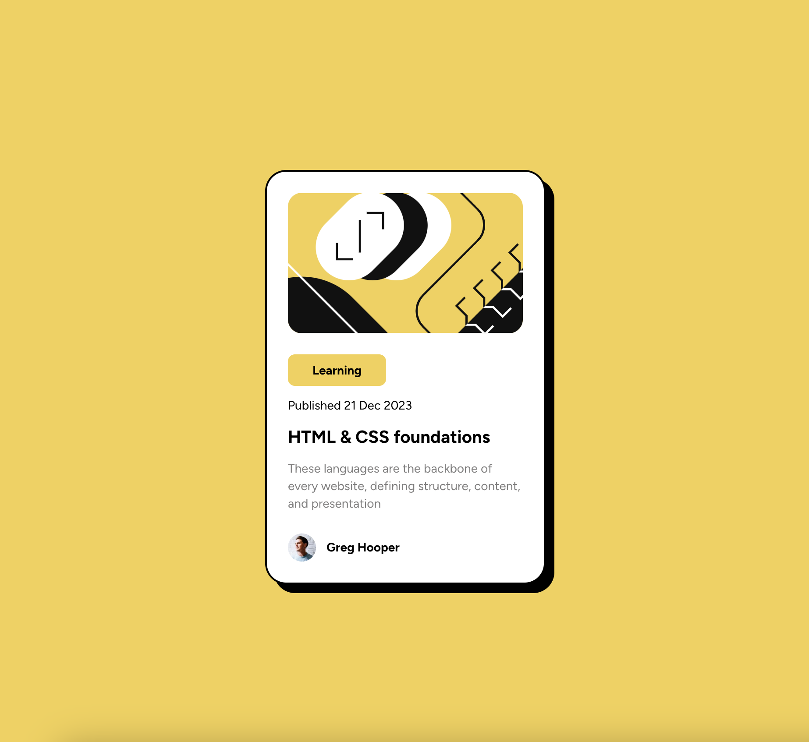

# Frontend Mentor - Blog preview card

This is a solution to the [Space tourism website challenge on Frontend Mentor](https://www.frontendmentor.io/challenges/space-tourism-multipage-website-gRWj1URZ3).

## Screenshot

## Links

- Solution URL: [GitHub repo](https://github.com/TimWang95/blog-preview-card)
- Live Site URL: [solution demo](https://main--eloquent-maamoul-602672.netlify.app/)

## Built with
-  React
-  Tailwind css

## What I Learnd

- To practice with Tailwind css

## Author

-  [My GitHub](https://github.com/TimWang95)
-  [@TimWang95](https://www.frontendmentor.io/profile/TimWang95)

## Acknowledgments

- Challenge was provided by [Frontend Mentor](https://www.frontendmentor.io/home)
